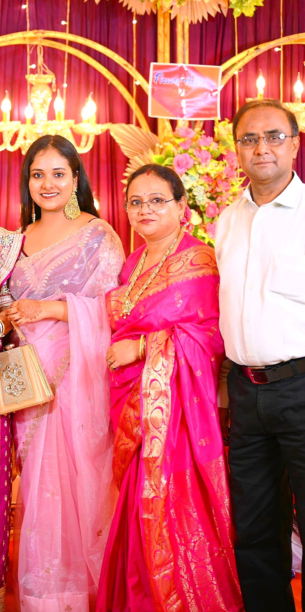
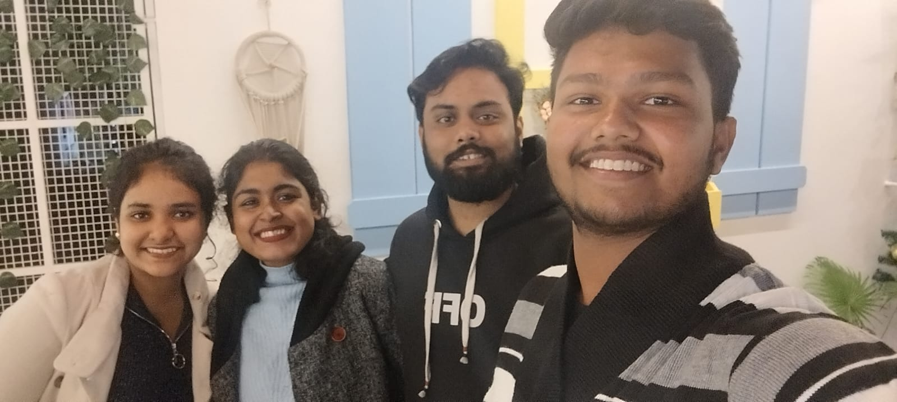
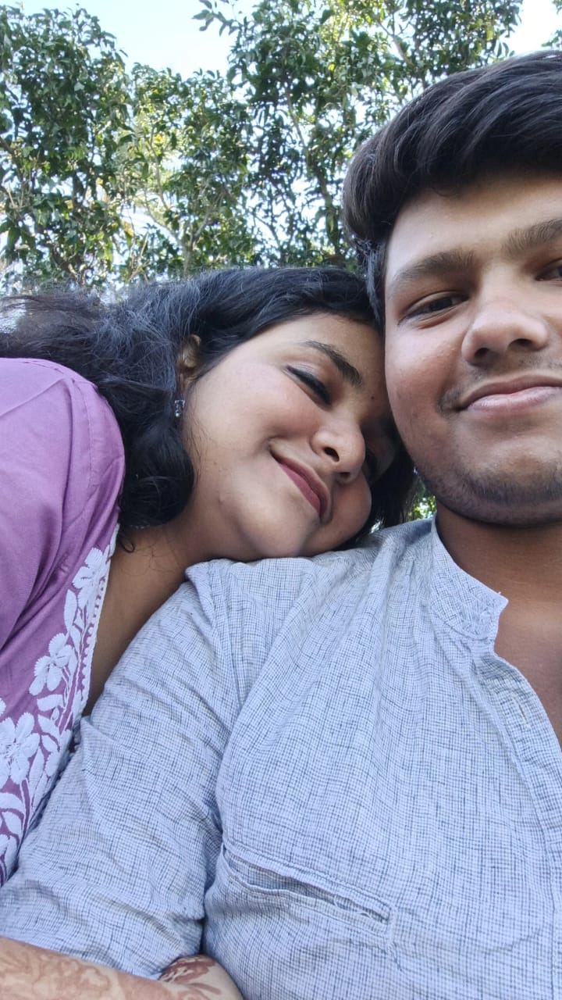
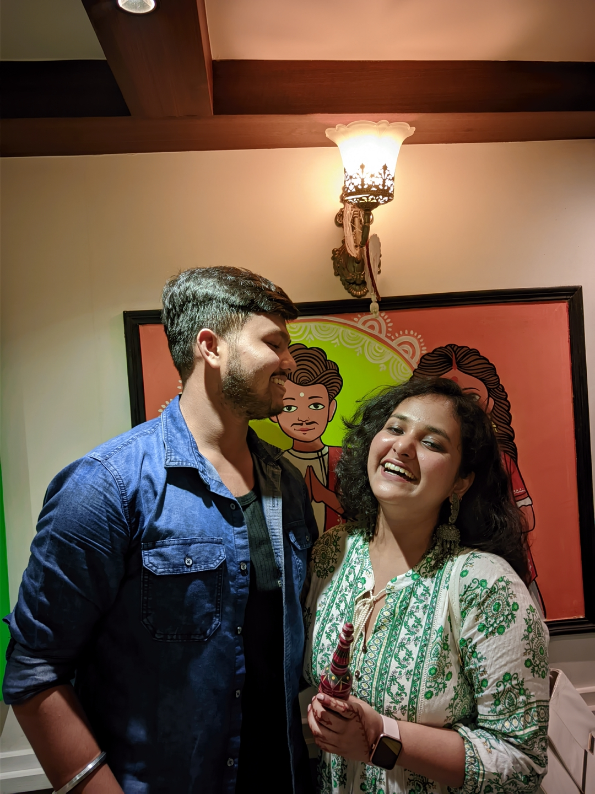
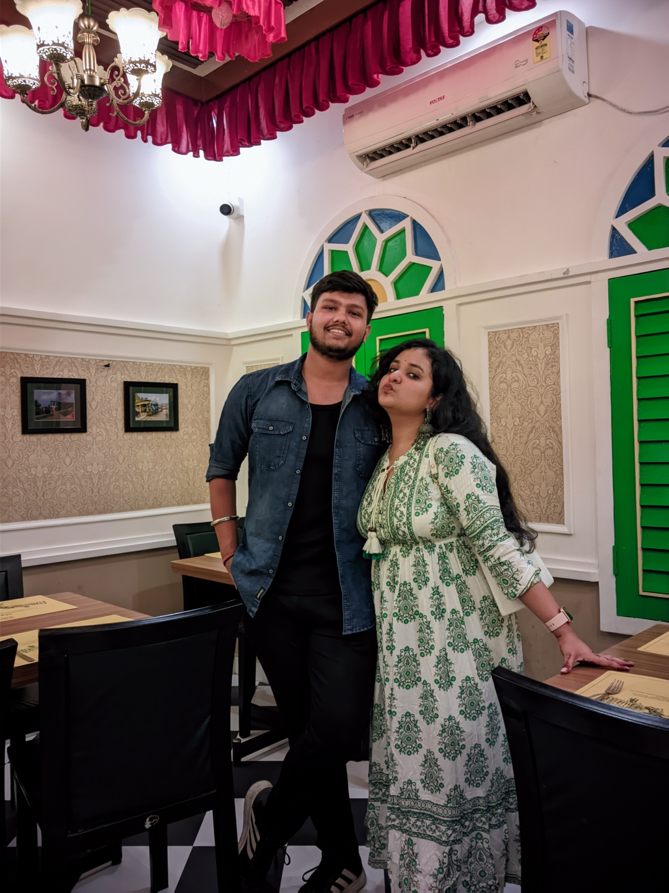
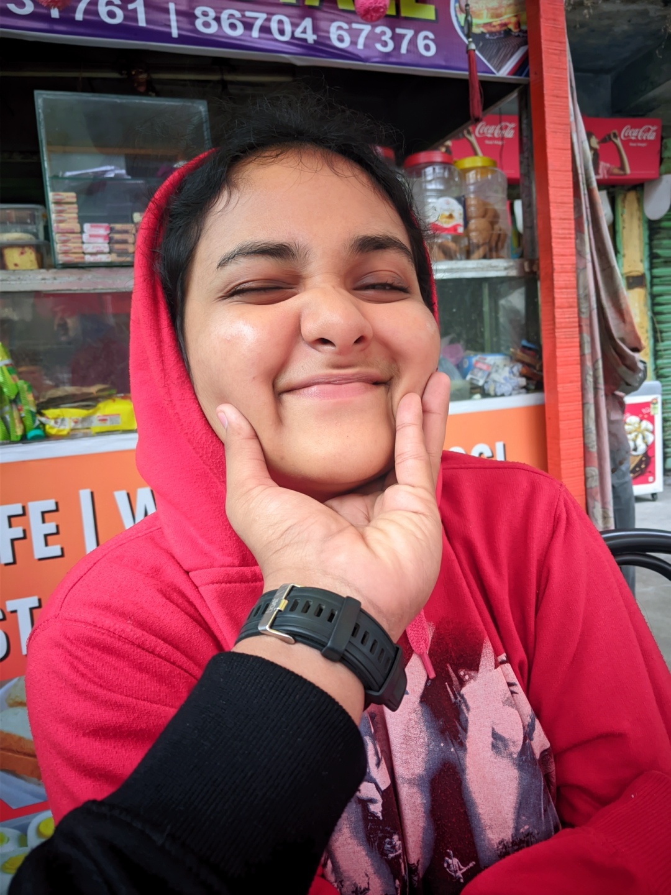
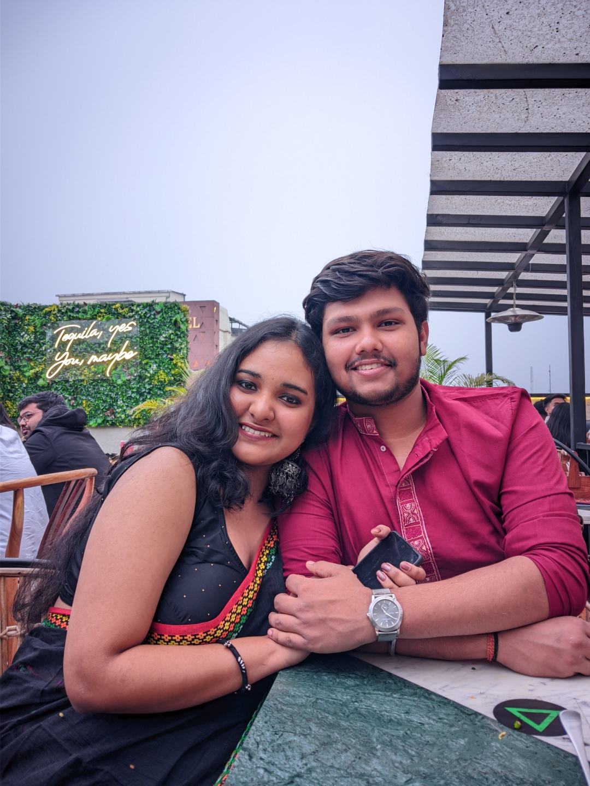
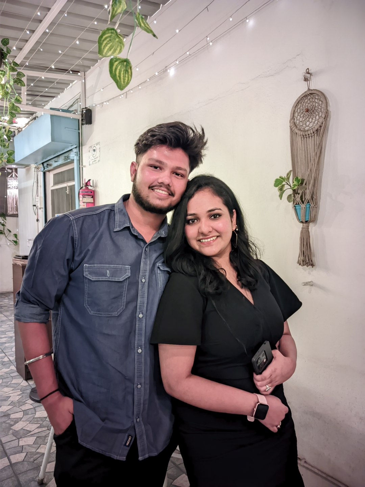

<html lang="en">
<head>
  <meta charset="UTF-8" />
  <meta name="viewport" content="width=device-width, initial-scale=1.0, viewport-fit=cover" />
  <title>Happy Birthday Tuuaa Raniii ❤️❤️😘</title>

  <!-- Google Font -->
  <link href="https://fonts.googleapis.com/css2?family=Dancing+Script&display=swap" rel="stylesheet">

  
</head>

<body>
  

    
Click Me 💝

    

      
🎂 Happy 19th Birthday 🎂

      
Tuuaa Raniii ❤️❤️😘

      
⬇️ Scroll down to reveal your surprise... ⬇️

    

    

      

        Happy 19th Birthday my love! ❤️ You make my world brighter every day. Your smile, your kindness, and your heart mean everything to me. I'm so lucky to have you in my life. May this year bring you endless happiness, laughter, and love. I love you more than words can say, Tuuaa Raniii! 😘💕
      

    

    

      
❤️

      
Click the heart to open your surprise!

    

    

      
      
      
      
      
      
      
      
    

  

  <!-- Music Disc -->
  

  <!-- Love Shower Container -->
  

  <!-- Background Music -->
  <audio id="romanticAudio" preload="auto">
    <source src="romantic.mp3" type="audio/mpeg" />
  </audio>

  
</body>
</html>

